I've always wanted to create my own blog to share my solutions to different coding problems I've solved over the years. I've finally made time to create one.
After reading a few other developers blog posts I was able to get a solution working for me that I was happy with.

I started with a few requirements:

- Static site generator - I wanted to use a static site generator for its simplicity and speed benefits.
- Custom domain - I've purchased my own domain so I want to make sure I can use it for my blog.
- Fast & secure - I want it to be fast & be secure. Load times under 500ms would be great.
- Cheap, less than $50 per year - The domain is $20 a year from GoDaddy with privacy. That leaves $30 for hosting and security.

I am a .NET fanatic and everything Microsoft related so I will most always utilize their tools.
Another few requirements regarding personal preferences:

- Azure DevOps for version control
- Azure Pipelines for builds and release deployments (no dev deployment)
- Deployed in Azure

In this guide, we will setup Azure to host the blog via Azure CDN for speedy access. We will use Jekyll to generate our static site. Since I don't want to install Ruby or Jekyll on my computer, we will develop the site in VSCode using dev containers. With dev containers, we can develop inside a container that already has Ruby and Jekyll installed.


---


### Prerequisites

- Azure subscription

- Azure DevOps

- A custom domain

- Visual Studio Code with the [Remote - Containers](https://marketplace.visualstudio.com/items?itemName=ms-vscode-remote.remote-containers) extension

- Docker Desktop


---


## Create project in Azure DevOps

Login to your DevOps account [https://dev.azure.com/](https://dev.azure.com/).

Add a new project, making sure *Version control* is set to **Git**.

Navigate to **Repos** > **Files**.

Now we are going to **Clone in VS Code** for next steps


---


## Generate the site with Jekyll inside a Dev Container

[Check out Microsoft's dev containers tutorial](https://code.visualstudio.com/docs/remote/containers-tutorial)

We have an empty repo now open in VS Code. To get started, lets get our dev container running. To do this,
open the `Command Pallete` and run the task `Remote-Contianers: Open Folder in Container`.


Select your repo folder. Once you do this, VS Code will ask you to choose the correct configuration files.

Make sure to select `Jeykll`.


This will automatically create the dev containers config file, Dockerfile, and VS Code Jekyll specific tasks.

I've made a few small modifications to the configuration files.

In the dev container Dockerfile lets uncomment the section to update and install other packages. I'd like to install git as well.

```Dockerfile
RUN apt-get update && export DEBIAN_FRONTEND=noninteractive \
    && apt-get -y install git
```

We also want the bundler to install packages after the dev container is created. To do this, open `devcontainer.json` and uncomment the line `"postCreateCommand": "bundle install",`.

If you don't already have the proper `.gitignore` file in your project directly, create one with the following contents:

```
_site
.sass-cache
.jekyll-cache
.jekyll-metadata
```

Your development environment is now running in a container so lets get down to business and create our Jekyll site.

Open a terminal window. Since our dev environment is running in a container with Linux, we are presented with a bash terminal.

Create a new Jekyll site in the current folder. Jekyll will create the site and run `bundle install` to install the required gems.

```powershell
jekyll new ./
```

Your projects file structure should now be similar to the following.


Now we are going to build and run the site to check it out. We can manually execute the commands, or use one of the two VS Code tasks that were created for us in `tasks.json`. Lets run the `Serve` task. Open the `Command Palette` and
search/click `Tasks: Run Task`, then click `Serve`.


After your site is built, navigate to `http://localhost:4000/` in a browser.

Voilà, we now have a generated static website!


---


## Create a build pipeline

We are going to create a build pipeline in Azure DevOps so the site is built each time a push is made to the master or a tag is created. The built site is stored as an Artifact and can be used in other pipelines.

Navigate to **Pipelines** > **Pipelines** and click **Create Pipeline**.

You will be asked where your code is. Select **Azure Repos Git**.

Then select your repository.

Choose the **Starter pipeline**. Now replace its contents with this yaml: [Azure pipelines yaml](#azure-pipelines-yaml)

Click **Save and run**, specify commit message and options, then click **Save and run** again.


---


## Create a Release Pipeline

Our site is built and stored in DevOps as an Artifact, waiting to be deployed. We will create a release pipeline
that will deploy our site to Azure.

Navigate to **Pipelines** > **Releases** and click **New pipeline**.

Select **Empty job**


Click **X** to close the Stage pane.


Click **Add an artifact**.

Choose *Build*, select your *Project*, then select the build pipeline we created previously as the *Source*. Click **Add**.

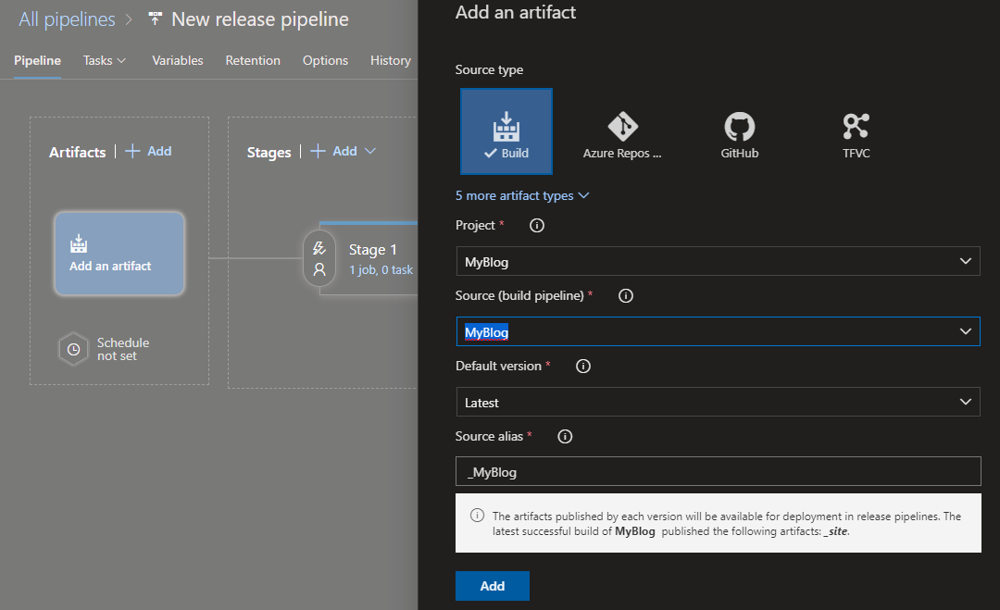

We have now added the artifact so it can be used by the pipeline.

Under *Stage 1*, click **1 job, 0 task**.

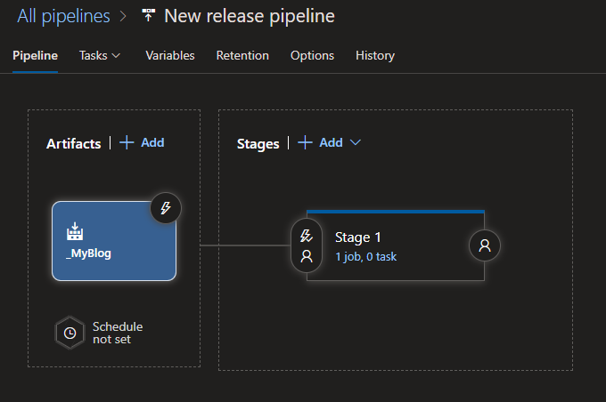

#### Add tasks

We have two new tasks to add.

1. The first is to Sync the files in the Artifact with your static website container in the Azure Storage account specified. Click the **+** to add a new task.

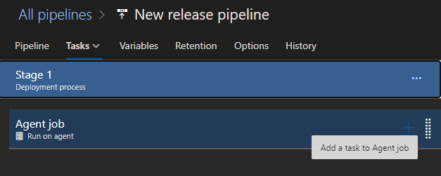

Add an `Azure CLI` task.

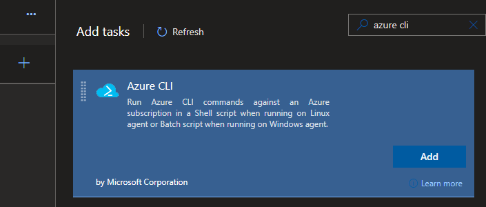

I updated the *Display name* to **Sync files**, set my Azure subscription and changed the *Script Location* to *Inline script*. Set the inline script to the below.

```powershell
az storage blob sync --source $(source) --container $(containerName) --account-name $(storageAccount) --auth-mode key --account-key $(key)
```

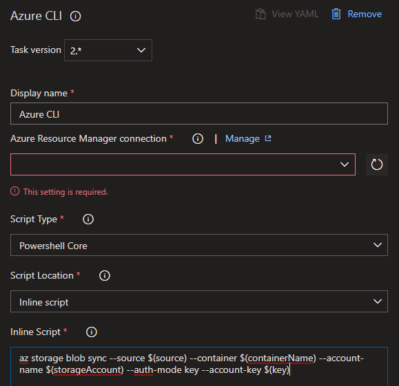

2. The second is to Purge the CDN of all cached files so the new site is pulled and cached.

Add another `Azure CLI` task.

I updated the *Display name* to **Purge CDN**, set my Azure subscription and changed the *Script Location* to *Inline script*. Set the inline script to the below.

```powershell
az cdn endpoint purge --profile-name $(cdnProfile) --content-paths /* --name $(endpointName) --resource-group $(resourceGroup)
```


#### Add variables

Both of our tasks use multiple variables to define. While still editing Release, click **Variables**.

Add the following variables:

**Sync files**

*source*: Folder name in the artifact that contains the site

*containerName*:  $web (set by Azure)

*storageAccount*:  The name of your storage account

*key*: Access key to your storage account

**Purge CDN**

*cdnProfile*: The name of the CDN Profile used by the Endpoint resource

*endpointName*: The name of the Endpoint

*resourceGroup*: The name of the Resource Group that contains the Endpoint

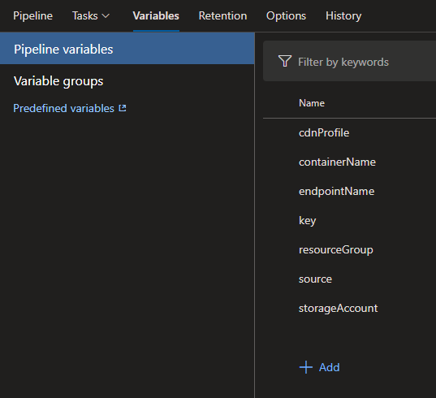

**Make sure to Save your pipeline**

#### Create a release

In the top right next to the Save button you just clicked, click **Create release**, after the dialog shows, click **Create**.

This process may take a few minutes. Once complete, open a browser and navigate to the storage accounts `Primary endpoint` you wrote down previously. Your site should now be deployed!

As it stands, you can release a new version of your site by:

1. Making changes in VS Code
2. Committing changes
3. Wait for build pipeline to succeed
4. Create release pipeline
5. View new deployment in a browser

The web address to access the site is currently the `Primary endpoint` for the Storage accounts web container.


---


## Create a resource group in Azure

Create a resource group in Azure that will hold all of the blogs resources. In this instance, I'm naming the resource group `BlogResourceGroup`.

---


## Setup storage account in Azure

**Create** a storage account in Azure


In the storage account, go to **Static website**. Set the `Static website`
option to `Enabled`. **Save** the change.


Write down the `Primary endpoint`. You will need it later.


---


## Configure Azure CDN to enforce HTTPS & setup custom domains

Now we want to utilize Azure CDN to cache the static site so it is fast & secure for viewers.

>**IMPORTANT**  
>I was able to get my apex domain added as a custom domain to my Azure CDN endpoint, but Azure no longer supports using their free SSL certificates for apex domains. I can't purchase one because it would blow my yearly budget. The option I came up with involves setting up Azure CDN using the `www` subdomain and then forwarding requests to the apex domain to the www subdomain. While I personally dislike having to use the `www` subdomain at all, it is providing me a free SSL certificate.

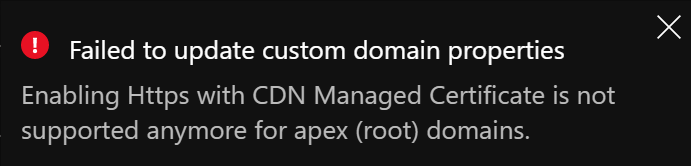

### Create Azure CDN endpoint

While viewing the storage account resource, under **Blob service**, go to **Azure CDN**.

From here, we are going to create a new `Endpoint`.

Create a new **CDN profile** with the name of your choosing.

Make sure the **Pricing tier** is set to *Premium Verizon* so we can set HTTP rules later.

Enter the **CDN endpoint name**.

Click **Create**.

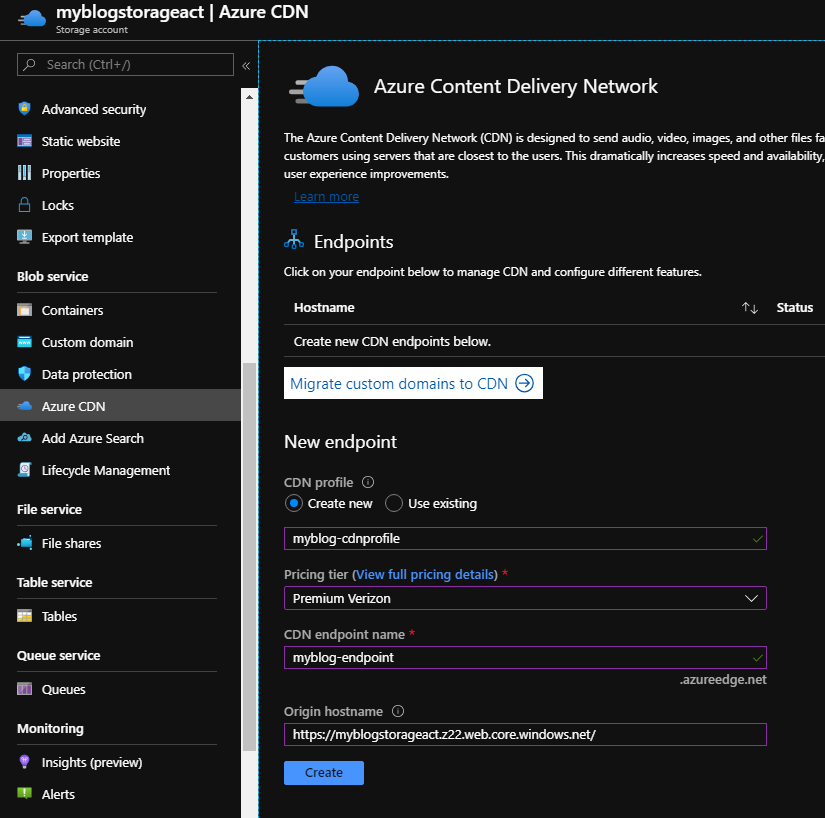

Navigate to the newely created resource.

Navigate to **Settings** > **Origin** and deselect **HTTP**. We only want to allow HTTPS.

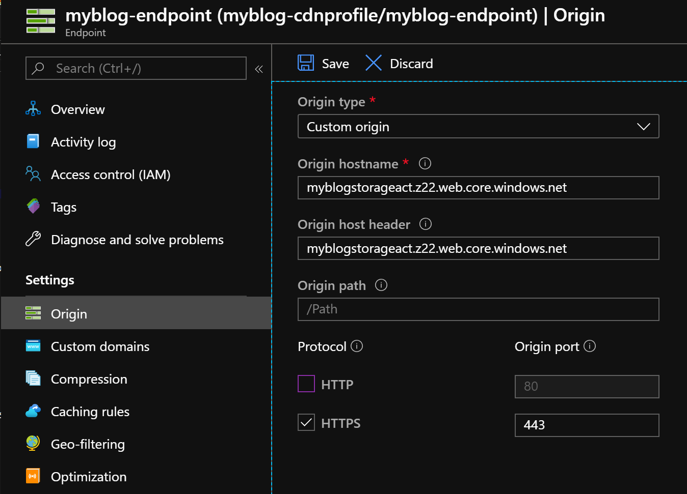

### Add DNS records to domain

In order to setup our custom domains Azure needs to verify you own the domain so we need to setup some CNAME records that Azure can verify.

Add a CNAME with **Host** `www` and **Value** `myblog-endpoint.azureedge.net`.

I'm using GoDaddy for my domains.

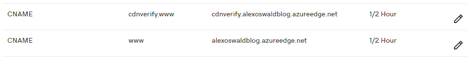

### Add custom domain to the CDN endpoint

Navigate to the Azure CDN Endpoint resource.

Navigate to **Settings** > **Custom domains** > **+ Custom domain**


Fill in your `www` subdomain. If Azure is able to verify your CNAME record you will see the green check, otherwise there will be a red X.


Now we need to enable HTTPS for the hostname.

Click your custom domain.


Set **Custom domain HTTPS** to **On**.

I am using Azure's free certificates so I set **Certificate management type** to **CDN managed**.

Then click **Save**.


In my experience, the certificate deployment process can take a few hours to complete.

Once complete, the screen should look like the below.


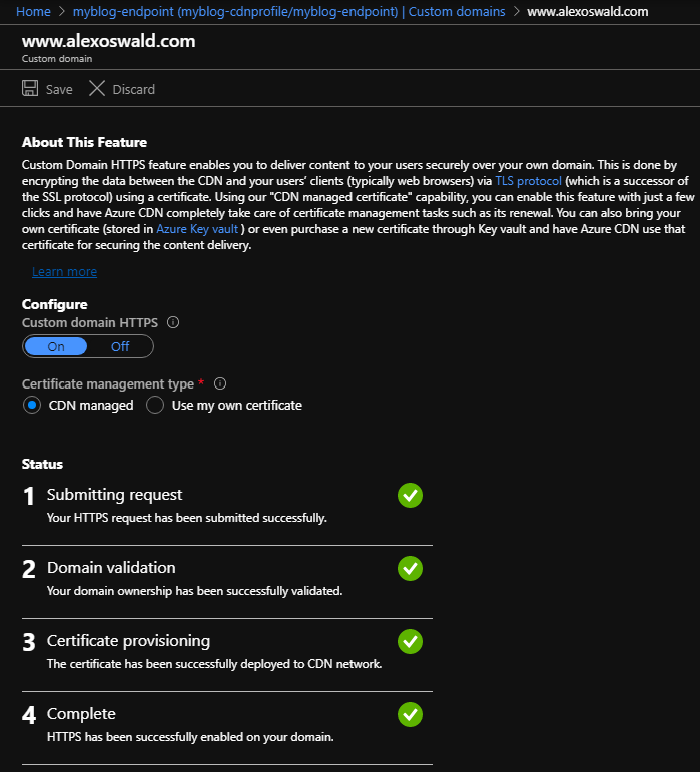


### Complete custom domain setup


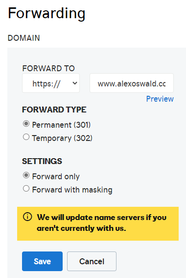


---


## Setup special HTTP rules for the CDN endpoint

Change text to lowercase.

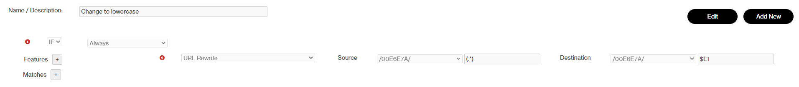


HSTS Header


HTTP to HTTPS Redirect


Redirect Root to WWW

**DID NOT WORK FOR ME**

This wasn't working for me. I had to use GoDaddy to forward the domain to the www subdomain, which was mapped to the Azure CDN endpoint.

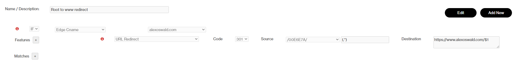


---


## Releasing a build to the static site container


---

## Appendixes


### Appendix A: Site urls

http://alexoswald.com - Redirected to Origin with GoDaddy domain forwarding

https://alexoswald.com - 

http://www.alexoswald.com - Redirected to Origin with CDN HTTP rule

https://www.alexoswald.com - Origin


### Appendix B: DevOps Code

`azure-pipelines.yaml`

```yaml
# Trigger pipeline on any push to master and any tag creations
trigger:
  branches:
    include:
    - master
  tags:
    include: ['*']

# Build on Ubuntu pool
pool:
  vmImage: 'ubuntu-latest'

steps:
# Use Ruby
- task: UseRubyVersion@0
  displayName: 'Use Ruby >= 2.5'
  inputs:
    versionSpec: '>= 2.5'

# Install Jekyll
- script: 'gem install jekyll bundler'
  displayName: 'Install Jekyll and bundler'

# Install Jekyll dependency
- script: 'bundle install'
  displayName: 'Install Gems'

# Run Jekyll and build the site
- script: 'bundle exe jekyll build'
  displayName: Build

# Copy packaged site to the staging directory for publishing
- task: CopyFiles@2
  displayName: 'Copy "_site" to staging directory'
  inputs:
    SourceFolder: '_site'
    TargetFolder: '$(Build.ArtifactStagingDirectory)'

# Publish the artifact
- task: PublishBuildArtifacts@1
  displayName: 'Publish Artifact: _site'
  inputs:
    ArtifactName: '_site'
```

#### Sync files

```yaml
# This code syncs with the storage blob you specify
# It won't delete all files, then upload. It will 
# upload only what is needed, and only delete what
# is needed (less operations).
steps:
- task: AzureCLI@1
  displayName: 'Sync files'
  inputs:
    azureSubscription: '$(subscription)'
    scriptLocation: inlineScript
    inlineScript: 'az storage blob sync --source $(source) --container $(containerName) --account-name $(storageAccount) --auth-mode key --account-key $(key)'
    workingDirectory: '$(System.DefaultWorkingDirectory)/_MyBlog'
```

#### Purge CDN

```yaml
# Purges the CDN's cache so it has to fetch new (updated)
# content from the storage container
steps:
- task: AzureCLI@1
  displayName: 'Purge CDN'
  inputs:
    azureSubscription: 'Visual Studio Professional (3a69699e-acaf-48c5-a4a3-d506bb04d4a6)'
    scriptLocation: inlineScript
    inlineScript: 'az cdn endpoint purge --profile-name $(cdnProfile) --content-paths /* --name $(endpointName) --resource-group $(resourceGroup)'
```

---


### Appendix C: References

Here are some other developer blog posts that helped me complete this project.

- [https://arlanblogs.alvarnet.com/adding-a-root-domain-to-azure-cdn-endpoint/](https://arlanblogs.alvarnet.com/adding-a-root-domain-to-azure-cdn-endpoint/)
- [https://www.glennprince.com/article/moving-my-site-onto-a-cdn/](https://www.glennprince.com/article/moving-my-site-onto-a-cdn/)
- [https://www.duncanmackenzie.net/blog/azure-cdn-rules/#redirecting-the-root-domain-to-the-www-version](https://www.duncanmackenzie.net/blog/azure-cdn-rules/#redirecting-the-root-domain-to-the-www-version)