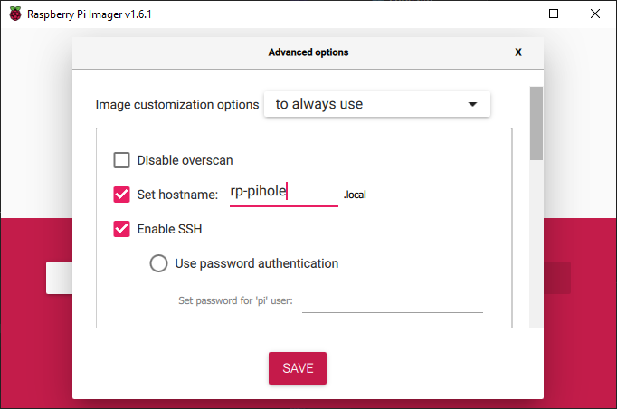

I've been wanting to setup Pi-Hole in my house for quite some time and I finally got around to getting it done. It has been working great so far, blocking an average of 15-20% of requests. This blog post explains how I'm running Pi-Hole via Docker on a Raspberry Pi.

I'm dedicating a Raspberry Pi 4 to the task. With all the Docker work I've been doing lately, I decided to run Pi-Hole in a container, and you can too.

>__VPN Notice__
>
>If you use a VPN, remember to disable options to only use their DNS servers. If you do not, devices connected to a VPN using their DNS servers will not see the benefit of Pi-Hole.


## Prerequisites

- Raspberry Pi 4 Model B
- Micro SD card 8GB or larger
- SSH public key [read Raspberry Pi's docs how](https://www.raspberrypi.org/documentation/remote-access/ssh/passwordless.md)


## Prepare the Raspberry Pi SD card

First, we are going to prepare the SD card by downloading/installing Raspberry Pi Imager, and imaging our card. We will set up Wifi and SSH through the imager so we don't need to do it manually later.

[https://www.raspberrypi.org/software/](https://www.raspberrypi.org/software/)

Run the imager once installed.

Image with Raspberry Pi OS Lite (32-bit)

Press `Ctrl+Shift+X` to open *Advanced options*
- Set a hostname, I named mine `rp-pihole`
- Enter your ssh public key
- Configure Wifi
- Set locale settings



Install the SD card into the Pi and power it on.


## Remote into the Pi

The Pi should be fully booted after a few minutes. Now we can SSH in.

```bash
ssh pi@rp-pihole
```

Where `pi` is the username and `rp-pihole` is the hostname.

Now that we are in, we need to _update & upgrade_, then install docker & docker compose.

```bash
sudo apt-get update && sudo apt-get upgrade
```

## Install docker

Download the Docker installation script & execute it.

[https://github.com/docker/docker-install/blob/master/install.sh](https://github.com/docker/docker-install/blob/master/install.sh)

```bash
curl -fsSL https://get.docker.com -o get-docker.sh && sudo sh get-docker.sh
```

We can delete the file now.

```bash
rm get-docker.sh
```

Setup non-root user to Docker group so we can execute docker without `sudo`. Logout and back in so changes take affect.
```bash
sudo usermod -aG docker pi
logout
```

Check the version to verify installation. If you don't see info for the Docker Engine, you may need to reboot the device.
```bash
docker version
```

You will see something similar to:

```
Client:
 Cloud integration: 1.0.17
 Version:           20.10.7
 API version:       1.41
 Go version:        go1.16.4
 Git commit:        f0df350
 Built:             Wed Jun  2 12:00:56 2021
 OS/Arch:           windows/amd64
 Context:           desktop-linux
 Experimental:      true

Server: Docker Engine - Community
 Engine:
  Version:          20.10.7
  API version:      1.41 (minimum version 1.12)
  Go version:       go1.13.15
  Git commit:       b0f5bc3
  Built:            Wed Jun  2 11:54:58 2021
  OS/Arch:          linux/amd64
  Experimental:     false
 containerd:
  Version:          1.4.6
  GitCommit:        d71fcd7d8303cbf684402823e425e9dd2e99285d
 runc:
  Version:          1.0.0-rc95
  GitCommit:        b9ee9c6314599f1b4a7f497e1f1f856fe433d3b7
 docker-init:
  Version:          0.19.0
  GitCommit:        de40ad0
```

## Install docker compose

```bash
sudo apt install -y python3-pip libffi-dev
sudo pip3 install docker-compose
```

Check the version to verify installation.
```bash
docker-compose version
```

You will see something similar to:

```
docker-compose version 1.29.2, build 5becea4c
docker-py version: 5.0.0
CPython version: 3.9.0
OpenSSL version: OpenSSL 1.1.1g  21 Apr 2020
```


## Create our files

On our dev machine, we will create two files:
- `docker-compose.yml` - Our compose file
- `.env` - The environment variables file


### Create the environment variables file

Create a `.env` file with the contents:

```
PIHOLE_IPADDRESS=10.10.10.2
PIHOLE_HOST=pi.hole
PIHOLE_TIMEZONE=America/Los_Angeles
PIHOLE_WEBPASSWORD=
```

`PIHOLE_IPADDRESS` - This is the IP address of the Pi running Pi-Hole (it should be statically reserved by your router).

`PIHOLE_HOST` - The host used to access the admin console.

`PIHOLE_TIMEZONE` - Your timezone.

`PIHOLE_WEBPASSWORD` - Password for the admin console.


### Create the compose file

Create a `docker-compose.yml` file with the contents:

```yml
version: '3.9'

services:
  pihole:
    container_name: 'pihole'
    image: 'pihole/pihole:latest'
    restart: 'unless-stopped'
    network_mode: host
    environment:
      ServerIP: '${PIHOLE_IPADDRESS}'
      VIRTUAL_HOST: '${PIHOLE_HOST}'
      TZ: '${PIHOLE_TIMEZONE}'
      WEBPASSWORD: '${PIHOLE_WEBPASSWORD}'
      DNSMASQ_LISTENING: all
      DNS1: '127.0.0.1'
      DNS2: '1.1.1.1'
    volumes:
      - 'pihole-data:/etc/pihole/'
      - 'pihole-dnsmasq:/etc/dnsmasq.d/'
    cap_add:
      - 'NET_ADMIN'

volumes:
  pihole-data:
  pihole-dnsmasq:
```

The above configuration allows Pi-Hole's DHCP server to work properly on my network.


## Copy files to the Pi

Open a terminal in the directory of the files you just created. Run secure copy to copy the `.env` and `docker-compose.yml` files to the Pi.

```
scp -r .\.env .\docker-compose.yml pi@rp-pihole:/home/pi
```

## On the Pi...

The next step is simple, fire up Pi-Hole!

Run docker compose

```
docker-compose up -d
```

Check container status or Pi-Holes logs if you wish:

```
docker ps
docker logs pihole
```

Give it a minute to start up and you should now be able to visit the admin console in a web browser. [http://pi.hole](http://pi.hole)


## Start the DHCP server

>To enable the DHCP server you must __first__ disable your routers DHCP server.

In Pi-Hole's admin console, go to Settings, then to the DHCP tab.

Check `DHCP server enabled` and click `Save`.

Once enabled, it may take some time for devices IP address leases to expire, and ask Pi-Hole's DHCP server for a new IP address. Once they do, the devices will show up in the `DHCP leases` section of the page.


## Success

Once devices start requiring IP addresses from Pi-Hole's DHCP server, Pi-Hole will start doing its magic and blocking a ton of ad and metric sites.


## Troubleshooting

I was having an issue where my pihole device would loose its DHCP reservartion after 24 hours and the device wouldn't assign itself a static IP so it would get assigned a random IP which caused DNS to stop working on the network and everything connected to break. The Raspberry Pi running pihole may need some additional configuration to make sure it assigns itself with the same static IP. To do this, edit `dhcpcd.conf` with the following command:

```
sudo nano /etc/dhcpcd.conf
```

Add the following:

```
# It is possible to fall back to a static IP if DHCP fails:
# define static profile
profile static_eth0
static ip_address=10.10.10.2/24
static routers=10.10.10.1
static domain_name_servers=10.10.10.1

# fallback to static profile on eth0
interface eth0
fallback static_eth0
```

Where 10.10.10.1 is the routers IP address, and 10.10.10.2 is Pi-Holes IP address.

>If you are using the wireless interface `wlan0`, replace instances of `eth0` with `wlan0`. Don't forget to check your compose file, `DNSMASQ_LISTENING` should be set to the interface you are using or set to `all`.


## Thank you

Check out my home infrastructure repo to see what I'm running!

[https://github.com/alex-oswald/HomeInfra](https://github.com/alex-oswald/HomeInfra)

More specifically for Pi-Hole!

[https://github.com/alex-oswald/HomeInfra/tree/main/pi-hole](https://github.com/alex-oswald/HomeInfra/tree/main/pi-hole)

That's all for this post. Hopefully you enjoyed this quick tutorial on setting up Pi-Hole in Docker on a Raspberry Pi.

If you have any comments, please feel free to email me at [alex@oswaldtechnologies.com](mailto:alex@oswaldtechnologies.com).

-Alex