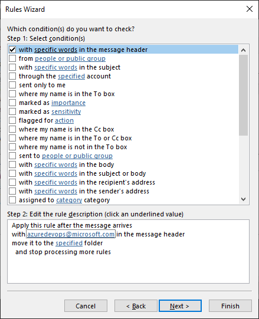

I get a lot of different alert emails, from Azure DevOps, AWS, etc. Setting up rules to move these emails to different folders is important for my sanity. Alert emails I typically get come from a central source, and the *on behalf of* email is from the root source, like Azure DevOps or AWS. This post answers the question:

## How do I setup an Outlook rule to filter *on behalf of* emails?

- Open the **Rules and Alerts** window in Outlook
- Click **New Rule...**
- Click **Next** to skip to the advanced setup

Unfortuantely, we can't create a rule for *on behalf of* email address using the `from people or public group`. The address is stored in the email header though, so we can search the header for the address.

- Select **with specific words in the message header**
- Click **specific words** in Step 2 to add the email address you want to filter on

- Click **Ok** to exit the **Search Text** dialog

- Select the folder you want to move emails to and click **Finish**

