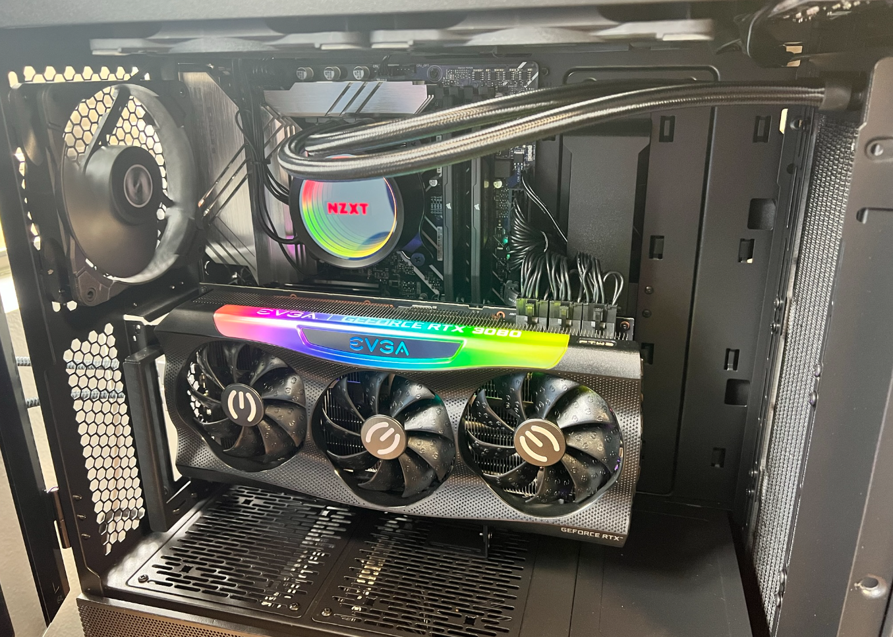

## It's time to build a beast of a development/gaming desktop PC in 2022!

The last computer I purchased was a Surface Book 2, over 4 years ago. It did an okay job for development, but it wasn't great for gaming, and wasn't VR ready. The biggest flaw for development was the RAM, with only 16GB. It wasn't great running multiple instances of Visual Studio and multiple docker containers. There were countless times I found myself needing to close a VS instance to free up memory. For this build, I wanted a higher end desktop that would be able to tackle all the development I do, and be VR ready, and not completely break the bank.

## Requirements

- VR Ready (because Half-Life: Alyx of course)
- 12th Gen i9
- 32GB+ DDR5 (maybe 64GB)
- Under $3000

## Bill of Materials

Here's what I came up with. Over the course of a month after I built the PC (while my return window was still good), a few components were on sale on Amazon so I ordered the components again and returned the new components under the old orders to get the cheaper price. I was able to save $80 on the GPU and $30 on the RAM this way. Further, I got 5% back using my Amazon Prime credit card, which brought the total to almost $300 less than my budget.

| Component | | Price |
|--|--|--:|
| Case | [Lian Li LANCOOL II MESH PEROFRMANCE Black LAN2MPX Tempered Glass ATX Case](https://a.co/d/3xQkjX1) | $163.07 |
| Motherboard | [ASUS Prime Z690-P](https://a.co/d/4eYEWn0) | $210.35 |
| CPU | [Intel Core i9-12900K](https://a.co/d/bEqUEqy) | $559.99 |
| RAM | [CORSAIR Vengeance DDR5 32GB (2x16GB) DDR5 5600](https://a.co/d/0ooxSGp) | $229.99 |
| GPU | [EVGA GeForce RTX 3080 FTW3](https://a.co/d/8KZB8Dn) | $779.99 |
| Hard Drive | [SAMSUNG 980 PRO SSD with Heatsink 1TB PCIe Gen 4 NVMe M.2](https://a.co/d/9IFAaER) | $139.99 |
| Power Supply | [Seasonic PRIME TX-850, 850W 80+ Titanium](https://a.co/d/e7ITX19) | $259.99 |
| Thermal Paste | [Arctic Silver 5 AS5-3.5G](https://a.co/d/jhax7vq) | $7.90 |
| CPU Cooler | [NZXT Kraken X73 360mm - RL-KRX73-01](https://a.co/d/gSc7RZr) | $157.99 |
| Vertical GPU Mount | [EZDIY-FAB Vertical PCIe 4.0 GPU Mount](https://a.co/d/h3tlfYS) | $59.99 |
| Bluetooth Adapter | [Long Range Bluetooth Adapter for PC](https://a.co/d/blHiNCw) | $14.39 |

# Benchmarks

I'm not a hardcore benchmarker, so I stuck to only UserBenchmark and a few real world tests.

## UserBenchmark

[View my latest results](https://www.userbenchmark.com/UserRun/54383734)

So far I've only clocked my RAM at 5200MHz.

**UserBenchmarks** Game 264%, Desk 119%, Work 300%

**CPU** 119.2%

**GPU** 227.8%

**SSD** 401.5%

**RAM** 177%

## Visual Studio Builds

For this benchmark I built one of my open source projects, [WindowsFormsLifetime](https://github.com/alex-oswald/WindowsFormsLifetime). This isn't a big solution, but it's a real world test because it represents builds I'm actually running multiple times throughout the day. Before running `dotnet build`, I cleaned out the `obj` and `bin` folders to represent a fresh build.

| PC | 3 Run Avg |
|--|--|
| New Desktop | 1 seconds |
| Surface Book 2 | 8 seconds |

## 3D Printer Slicing

For this benchmark I used Ultimaker Cura to slice the [Forbidden Tower](https://www.thingiverse.com/thing:2574499) with the default *Standard Quality* settings. I didn't want to dive into setting up a program to accuratly time the slicing, so I went the old fashion route and used a stopwatch. I have to say, the time differences here were pretty incredible.

| PC | 2 Run Avg |
|--|--|
| New Desktop | 7 seconds |
| Surface Book 2 | 70 seconds |
